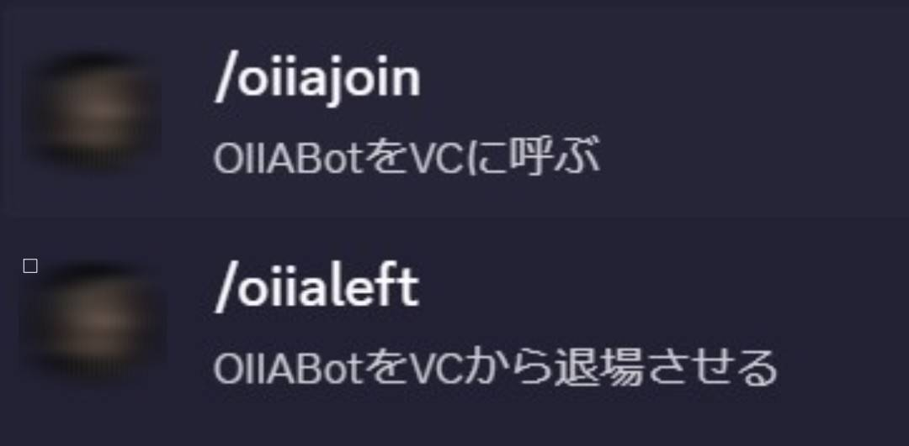
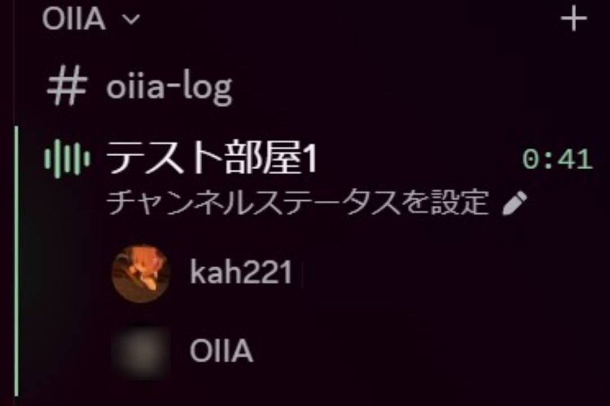
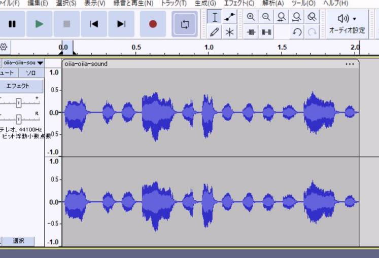
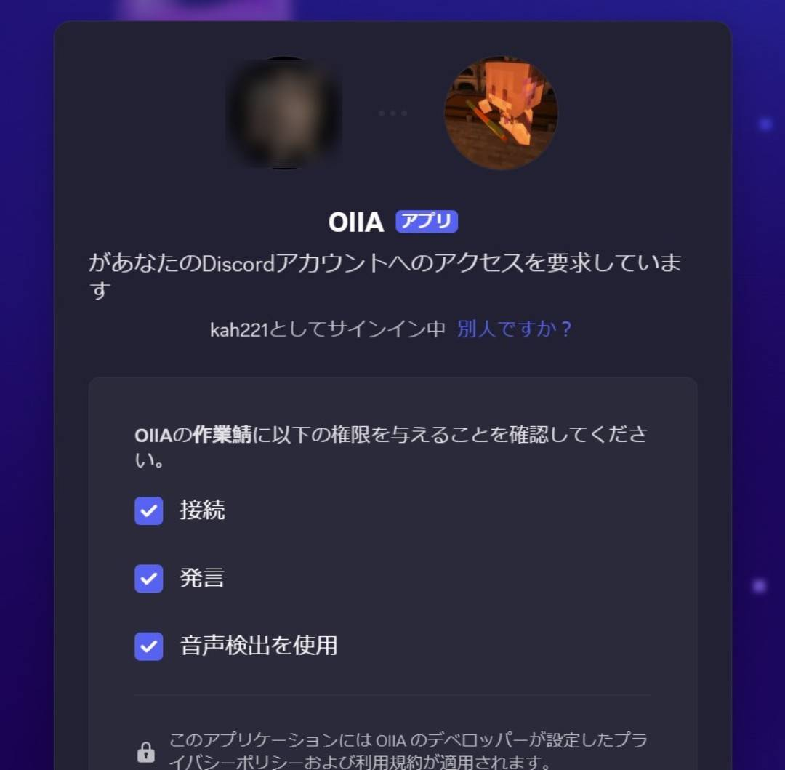
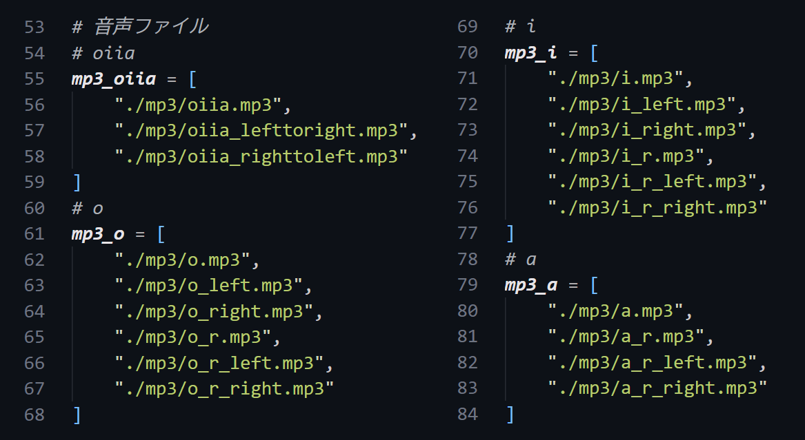
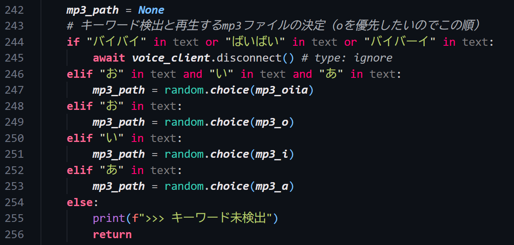

# discord-oiiabot
## 1. oiiabotとは
→ discordのボイスチャンネル(VC)に接続し、ユーザの声に対して音声でリアクションをするBot

昨年末に「特性のワードに反応してミーム音源を流す」というブログ $^{[1]}$ を見かけたのがきっかけです。卒論がひと段落したので作ってみました。以前作成した別のBotで、VC参加と音声再生はやったことがあったため比較的ハードルは低かったのですが、音声信号処理部分と、メモリに蓄積し続ける問題、特にクラスを使ったコーディングは今回が初めてで苦戦しました。Geminiに頼りつつ、できるだけ原理を理解することに努めました。複数サーバーでの同時運用は未検証ですが、再生までの絶妙な間など、暇つぶし程度にはちょうど良いと言える完成度になりました。

## 2. 使い方
- ユーザは予めVCに接続しておく
- /oiiajoin コマンドでBotをVCに接続させる
- マイクをONにして話す
- Botが音声認識を行い、特定のワードが含まれているときBotが音声を再生する
- /oiialeft コマンドでBotをVCから切断する
<div style="text-align: center;">

</div>
<div style="text-align: center;">

</div>

## 3. 機能詳細

### 3.1  特定ワードとリアクション
優先順に
- ばいばい or バイバイ or ばいばーい　→　Botが自らVCから退出する
- お and い and あ　→　音声: "oiiaioiiiiai"　(レア)
- お　→　音声: "o"
- い　→　音声: "i"
- あ　→　音声: "a"
音声は、例の猫ミームのa, o, iです

### 3.2  音声バリエーション
単なるo, i, aの再生ではなく、リバーブやパンを効かせた音声ファイルを用意しており、それらからランダムで再生される。（飽き低減）\
例）左右片方から聞こえる、左から右に移動して聞こえる、リバーブがかかっている...\
★音声ファイルは"Audacity"という無料ソフトで編集しました。
<div style="text-align: center;">

</div>

### 3.3  音声認識
Googleが提供する音声認識APIの無料枠を使用しています $^{[1]}$ 

### 3.4  ライブラリ
今回新たにpip installしたものは次の3つでした
#### **PyNacl**
→VCでの音声暗号化処理のために必要\
以前はこれ無しでVC関連のBotが作れていたが必要だった
#### **discord-ext-voice-receive**
→discord.pyに音声受信機能を追加するための拡張ライブラリ\
cmdでなくVSCodeターミナルからpip installしないと認識されなかった
#### **SpeachRecognition**
→音声認識を行うために必要
### 3.5  Botに与える権限
[DiscordのBot管理ページ](https://discord.com/developers/applications)の「OAuth2」タブで設定する。今回のBotには次の3つが最低限必要。
- Connect（VCに接続するため）
- Speak（VC内で音声を再生するため←mp3）
- Use Voice Activity（常時発生や音声取得の安定性のため推奨）
<div style="text-align: center;">

</div>

## 4. ディレクトリ構造と音声ファイル
- 音声ファイルはgitへあげていません。スクリプトを使用される際はスクリプト上部$^{[2]}$ と再生部分$^{[3]}$ のパスおよび変数を変えてください。（ミーム音源は私的利用の範囲で）
- .env内にDiscord Botのトークンやギルド同期用IDなどを記述しています
- oiia.pyがメインスクリプトです
```
[root]
|- [mp3]
|   |- a_r_left.mp3
|   |- a_r_right.mp3
|   |- a_r.mp3
|   |- a.mp3
|   |- i_left.mp3
|   |- i_r_left.mp3
|   |- i_r_right.mp3
|   |- i_r.mp3
|   |- i_right.mp3
|   |- i.mp3
|   |- o_left.mp3
|   |- o_r_left.mp3
|   |- o_r_right.mp3
|   |- o_r.mp3
|   |- o_right.mp3
|   |- o.mp3
|   |- oiia_lefttoright.mp3
|   |- oiia_righttoleft.mp3
|   \- oiia.mp3
|- .env
\- oiia.py
```
  [2]
  [3]

## 5. 参考
$[1]$ 黒神([@kokushing](https://x.com/kokushing))様：["特定のワードに反応してミーム音源を勝手に流すクソアプリ"](https://qiita.com/kokushin/items/a21f2045a033b689383e), Qiita, 2023/11/01 (2026/02/15 参照)

---
## 更新ログ
- 260215_0643　初着手
- 260215_1838　コード完成
- 260217_0123　Readme完成
- 260217_0135　誤字修正